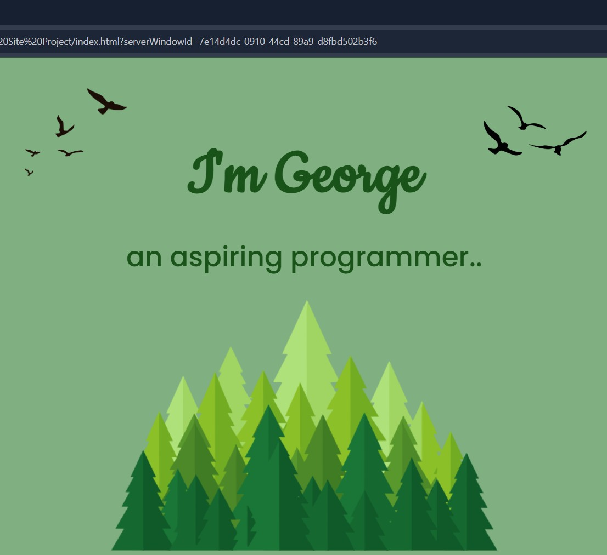
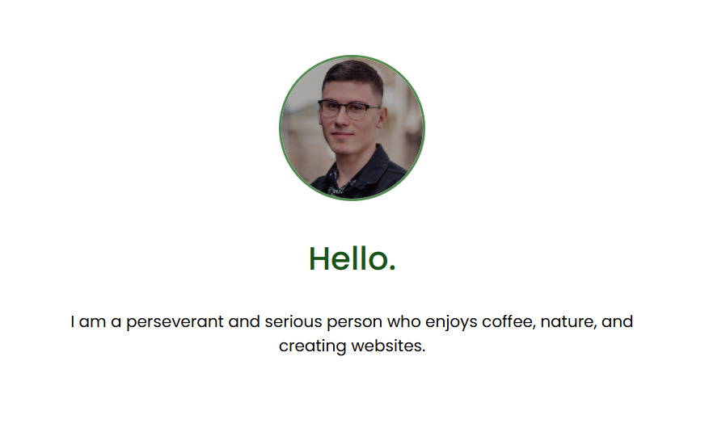
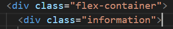
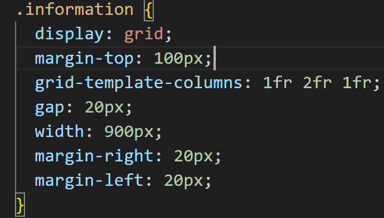
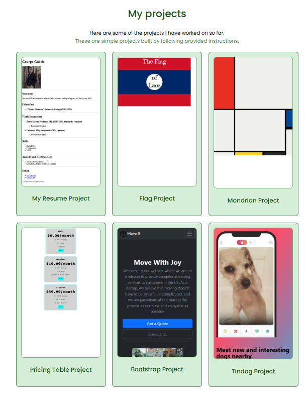
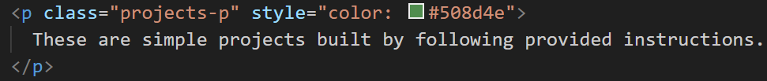
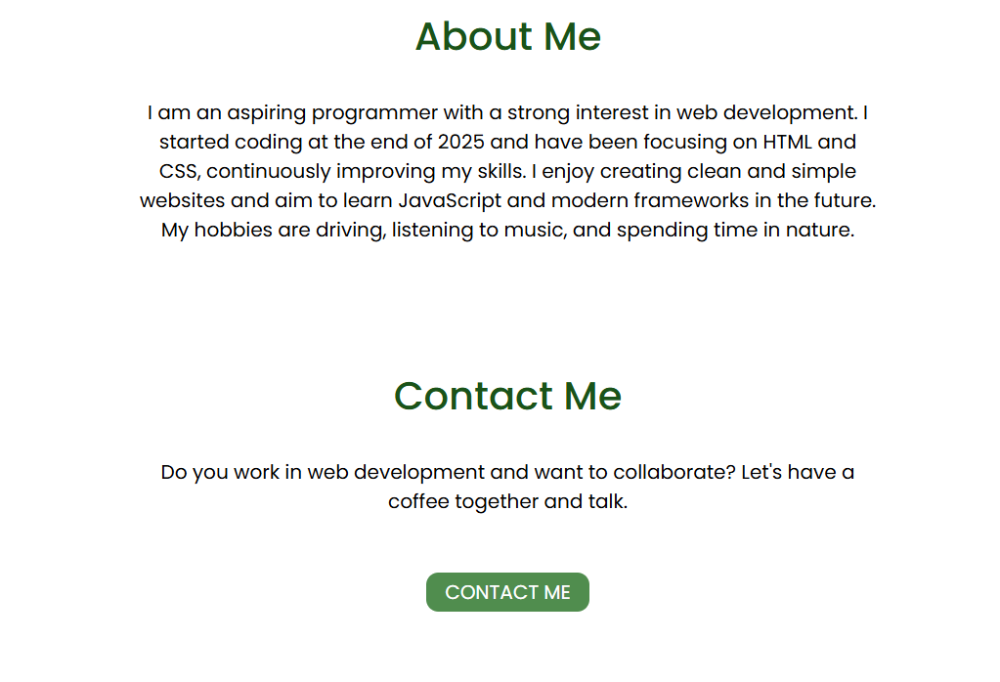

# Personal Site
## This project is a personal website that provides information about me and showcases some of the projects I have completed so far. It is built using HTML and CSS.
## [View the site](https://gavrisgeorge21.github.io/personal-site/)
## Top Container
The top container includes an h1, an h2, and images, styled using CSS.
### Preview

## Middle Container
The middle container is structured into multiple sections presenting my information, projects, and contact details.
### Intro 
This section features a personal photo along with a short introduction.

### Information
This container presents information about education, work experience and skills. It uses a grid layout nested within a Flexbox container for easier centering.

#### HTML
 
#### CSS

### Projects
This container follows the same Flexbox and Grid layout and includes links to each project.

#### One of the paragraphs uses inline CSS styling.

### About & Contact
These two containers use simple div elements, styled with basic centering and a button that links to an email contact.

#### Button HTML

#### Button CSS

